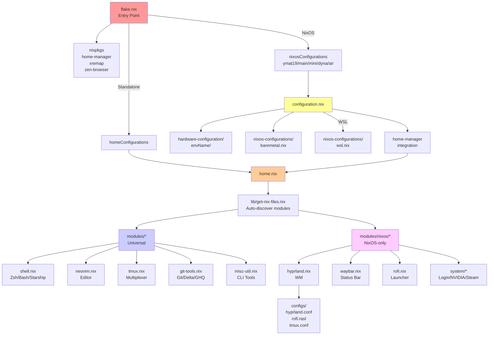
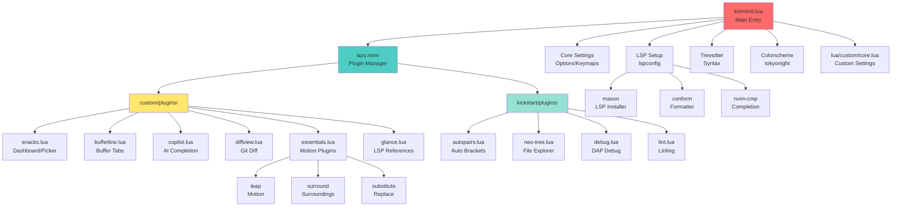

# Dotfiles

[](https://github.com/ymat19/dotfiles/actions/workflows/test.yml)
[](https://github.com/ymat19/dotfiles/actions/workflows/flake-update.yml)

このリポジトリは、[Nix](https://nixos.org/) と [home-manager](https://github.com/nix-community/home-manager) を使用して管理された個人用のドットファイル集です。スタンドアロンの home-manager と NixOS の両方に対応しており、特に WSL 環境にも配慮しています。

## 特徴

- **宣言的な構成管理**: Nix Flakes による再現可能な環境構築
- **モジュラー設計**: 機能ごとに分離されたモジュール構成
- **マルチプラットフォーム対応**: NixOS、WSL、スタンドアロン home-manager をサポート
- **マルチマシン対応**: x86_64 デスクトップ (main/mini/dyna) と Apple Silicon (air) に対応
- **充実した開発環境**: Neovim (LSP/Treesitter)、Tmux、Zsh、Git ツールなど
- **デスクトップ環境**: Hyprland (Wayland)、Waybar、Rofi など (NixOS のみ)

## クイックスタート

### 自動インストール

```bash
./install.sh
```

### 手動インストール

#### スタンドアロン home-manager のセットアップ

1. Nix をインストール:

```bash
curl -L https://install.determinate.systems/nix | sh
. /nix/var/nix/profiles/default/etc/profile.d/nix-daemon.sh
```

2. 構成を適用:

```bash
home-manager switch --flake .
```

#### NixOS のセットアップ

1. ハードウェア設定をバックアップし、このリポジトリにコピー:

```bash
# ハードウェア設定を適切なディレクトリにコピー
# 例: hardware-configuration/main/ または hardware-configuration/air/ など
cp /etc/nixos/hardware-configuration.nix ./hardware-configuration/<hostname>/
```

2. 既存の `/etc/nixos` をバックアップし、このリポジトリをリンク:

```bash
sudo mv /etc/nixos /etc/nixos.bak
sudo ln -s $(realpath $(pwd)) /etc/nixos
```

3. NixOS の構成をビルドして適用:

```bash
sudo nixos-rebuild switch --flake .#<hostname> --impure
```

利用可能なホスト名: `ymat19` (基本)、`main` (NVIDIA+Steam)、`mini` (Steam)、`dyna` (.NET)、`air` (Apple Silicon)

4. システムを再起動:

```bash
sudo reboot
```

## アーキテクチャ

### Nix ファイル構成



### 主要コンポーネント

#### Universal Modules (全環境)
- **shell.nix**: Zsh/Bash + Starship プロンプト + Oh-my-zsh
- **neovim.nix**: Neovim (LSP/Treesitter/Copilot)
- **vim.nix**: 基本的な Vim 設定
- **tmux.nix**: ターミナルマルチプレクサ (Vi モード)
- **git-tools.nix**: Git + Delta + GHQ + Git LFS
- **misc-util.nix**: fzf、ripgrep、fd、bat、lsd、autojump
- **tui-tools.nix**: Lazygit、Lazydocker
- **direnv.nix**: Direnv + nix-direnv
- **mise.nix**: バージョンマネージャ
- **aws.nix**: AWS CLI

#### NixOS-only Modules
- **hyprland.nix**: Hyprland WM + Hypridle + Hyprlock + FCitx5 + Kitty
- **waybar.nix**: ステータスバー (システムトレイ、時計、ワークスペース)
- **rofi.nix**: アプリケーションランチャー
- **screenshot.nix**: Grimblast + Swappy
- **cliphist.nix**: クリップボード履歴
- **zen-browser.nix**: Zen Browser (Firefox フォーク)
- **vscode.nix**: VS Code
- **remmina.nix**: リモートデスクトップ

#### System Modules (システムレベル)
- **login.nix**: Greetd ログインマネージャ
- **xremap.nix**: キーボードリマッピング (CapsLock→Ctrl、Alt+HJKL→矢印キーなど)
- **nvidia.nix**: NVIDIA ドライバ + Wayland サポート
- **steam.nix**: Steam ゲーミングプラットフォーム
- **dotnet.nix**: .NET 8.0 SDK
- **dolphin.nix**: KDE Dolphin ファイルマネージャ

### Neovim (kvim) 構成



### 主要な Neovim プラグイン

#### LSP & 補完
- **nvim-lspconfig** + **mason**: LSP サーバー管理 (lua_ls, nil, typescript-language-server)
- **nvim-cmp** + **LuaSnip**: 自動補完とスニペット
- **conform.nvim**: コードフォーマッター (stylua, prettier, nixpkgs-fmt)
- **copilot.lua**: GitHub Copilot AI 補完

#### UI & ナビゲーション
- **snacks.nvim**: ダッシュボード、ファイルピッカー、ターミナル統合
- **bufferline.nvim**: バッファタブ表示
- **neo-tree.nvim**: ファイルツリーエクスプローラー (`\` で切替)
- **which-key.nvim**: キーマップヒント表示

#### Git 統合
- **gitsigns.nvim**: Git 差分表示とハンク操作
- **diffview.nvim**: 差分ビューアー (`<leader>dd/da/dc`)

#### 編集とモーション
- **leap.nvim**: 高速移動 (`s`/`S`)
- **nvim-surround**: 囲み文字操作 (`cs`/`ds`/`ys`)
- **substitute.nvim**: 置換オペレータ (`rr`/`R`/`RR`)
- **dial.nvim**: インクリメント/デクリメント (`<C-a>`/`<C-x>`)
- **clever-f.vim**: 改善された f/t ジャンプ

#### 診断と品質
- **tiny-inline-diagnostic.nvim**: インライン診断表示
- **lsp_signature.nvim**: 関数シグネチャヒント
- **nvim-lint**: リンティング (markdownlint)
- **nvim-dap**: デバッグサポート (F5-F7)

### 主要なキーバインド

| カテゴリ | プレフィックス | 機能 |
|----------|---------------|------|
| **ファイル** | `<leader>f` | バッファ、設定、ファイル検索、Git ファイル、最近使用 |
| **検索** | `<leader>s` | バッファ行、grep、診断、ヘルプなど |
| **LSP** | `<leader>l` | コードアクション、リネーム、ホバー、定義、参照など |
| **Git** | `<leader>g` | ブランチ、ログ、ステータス、差分、lazygit |
| **トグル** | `<leader>u` | スペル、折り返し、行番号、診断など |
| **差分** | `<leader>d` | 差分を開く、すべて開く、閉じる |

リーダーキー: `<space>`

## 環境別の適用例

### スタンドアロン home-manager (非 NixOS)
```bash
home-manager switch --flake .
```

### NixOS デスクトップ (main - ゲーミング環境)
```bash
sudo nixos-rebuild switch --flake .#main
```
含まれるもの: NVIDIA ドライバ + Steam + Hyprland + すべての開発ツール

### MacBook Air (Apple Silicon)
```bash
sudo nixos-rebuild switch --flake .#air
```
含まれるもの: Apple Silicon サポート + すべての開発ツール

### WSL 環境
```bash
sudo nixos-rebuild switch --flake .#ymat19
```

## WSL 環境での注意点

Neovim のシンボリックリンクを作成:

```bash
sudo ln -s $(which nvim) /usr/local/bin/nvim
```

## その他のセットアップコマンド

```bash
# ghq ベースディレクトリを設定
git config --global --add ghq.root $(realpath ../)

# gitconfig を作成
touch ~/.gitconfig
```

## 構成ファイルの場所

- **Nix 設定**: `flake.nix`, `home.nix`, `configuration.nix`, `modules/`, `nixos-configurations/`
- **ハードウェア設定**: `hardware-configuration/`
- **外部設定ファイル**: `configs/`
  - Hyprland: `configs/hyprland.conf`
  - Rofi: `configs/rofi.rasl`
  - Tmux: `configs/tmux.conf`
  - Zsh: `configs/zshrc`
  - Neovim: `configs/kvim/` (機能豊富)、`configs/nvim/` (VSCode 統合用)

## 参考リンク

- [Home Manager Options Search](https://home-manager-options.extranix.com/?query=&release=release-24.05)
- [Nixpkgs Packages Search](https://search.nixos.org/packages?channel=24.11)
- [NixOS Options](https://search.nixos.org/options?channel=unstable)
- [Nix Flakes](https://nixos.wiki/wiki/Flakes)

## ライセンス

詳細は [LICENSE.md](LICENSE.md) を参照してください。
